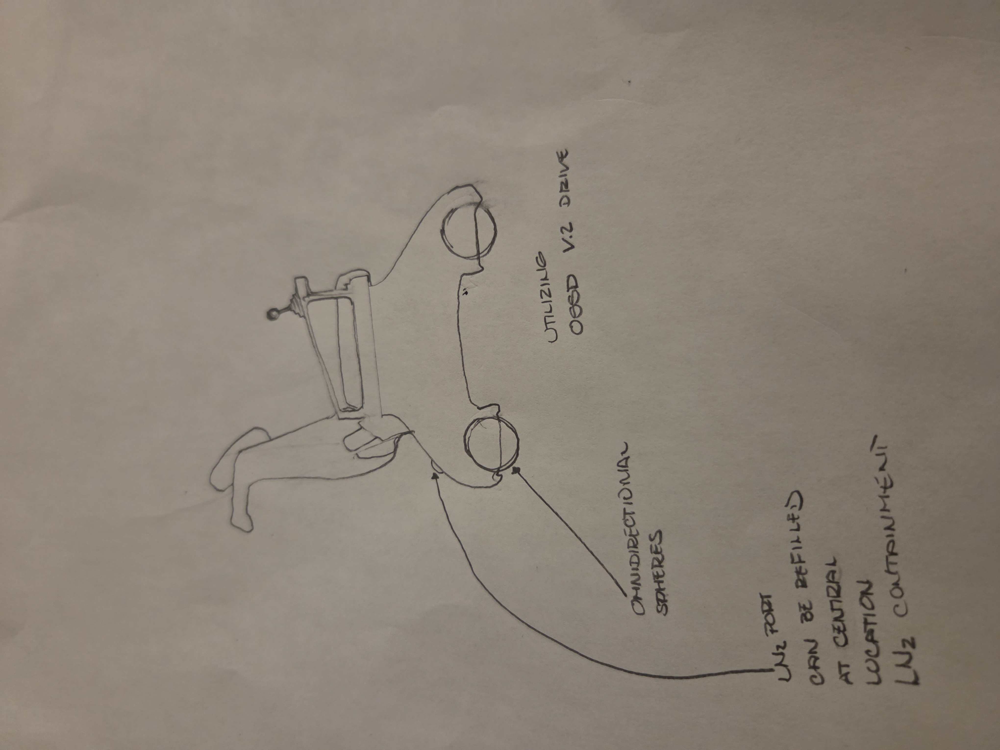

# OSSD™ — Omnidirectional Superconducting Spherical Drivetrain  
**NU·OIR LABS | Loren D. James**

Frictionless, tri-axial superconducting drivetrain architecture for true 360° mobility — from wheelchairs to autonomous platforms to next-generation propulsion.

---

## What this is
OSSD uses magnetic flux pinning between cryogenic superconductors (YBCO, MgB₂) and permanent magnets arranged in spherical configurations.  
That creates a stable, near-frictionless suspension that can translate and rotate in any direction.

Think: no casters, no wheels fighting you, no scrub, no drag.

---

## Why it matters
- **Assistive mobility:** Less strain on the user. Lower push force. Smoother navigation over real surfaces, not just perfect labs.
- **Autonomous robotics:** True holonomic motion without complicated multi-wheel steering.
- **Magnetically assisted propulsion concepts:** High-agility attitude control and maneuvering without traditional mechanical steering linkages.

---

## Core System Elements
- **Omnidirectional Sphere Assembly (YBCO / MgB₂):**  
  Flux-pinned spherical bearing system for 6-DOF stability.

- **Cryogenic Cooling Loop:**  
  LN₂ containment + refill port for continuous superconductor operation.

- **Stator & Coil Rings:**  
  Electromagnetic drive interface that can generate linear and rotational thrust.

- **Control Gimbal & Sensors:**  
  Real-time vector control of force, lift, and orientation.

---

## Prototype Direction: CryoCaster™
OSSD is first being applied to *CryoCaster™* — a superconducting front-end caster assist module for manual wheelchair users.

**Goals:**
- Reduce hand/wrist strain from caster drag.  
- Improve maneuverability on carpet, thresholds, rough flooring.  
- Add powered assist without converting the entire chair to 200+ lb of batteries and motors.

Early concept sketch (v0.1):  

> Omnidirectional spheres + refillable LN₂ pod + superconducting stabilization.  
> Draft sketch by Loren D. James (NU·OIR LABS).

---

## Development Status
**Phase I – Proof of Concept (current)**  
- Validate flux pinning stability and usable lift at small scale.  
- Single-pod cryogenic test with YBCO / NdFeB array.  
- Record force, drift, thermal behavior under load.  
- Publish transparently.

**Phase II – Assistive Mobility Pilot**  
- CryoCaster module for manual wheelchair.  
- Push-assist / steering-assist demo.  
- Safety, refill workflow, regulatory path.

**Phase III – Advanced Mobility / Propulsion**  
- Full multi-sphere OSSD pod arrays.  
- Multi-axis control for autonomous robotic platforms and vehicle-class applications.

For full roadmap, see: [`ROADMAP.md`](ROADMAP.md)

---

## License
MIT License. Open hardware / open research friendly.  
See [`LICENSE`](LICENSE).

© 2025 NU·OIR LABS. All rights reserved.
